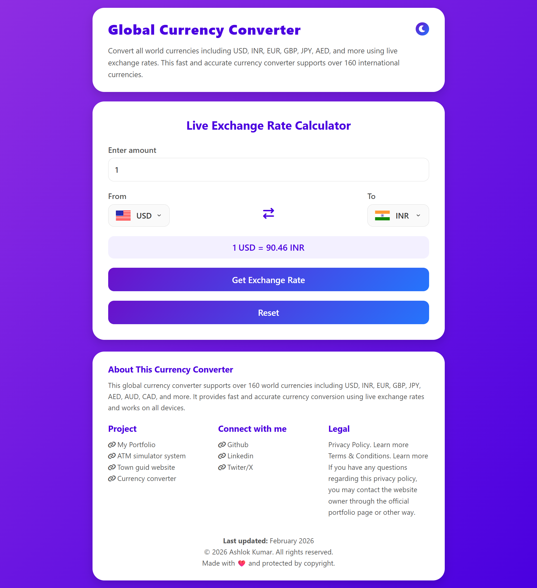

# 💱 Currency Converter Website

 A modern, responsive **Currency Converter** web application that allows users to convert currencies like **USD, INR,  EUR, GBP** using real-time exchange rates.  
 Built with **HTML, CSS, and JavaScript**, featuring **Dark Mode**, **flag icons**, and a clean UI.

---

## 🚀 Live Demo
### 🔗 https://forexlyglobal.vercel.app/

---

## 📸 Preview
  


---
## ✨ Features

- ⚡ Real-time currency conversion
- 🌍 Supports multiple global currencies
- 🌙 Dark / Light mode toggle
- 📱 ully responsive design
- 🚀 Fast performance (optimized DOM usage)
- 🎨 Clean UI & UX
- ♿ Accessible and SEO-friendly structure


---

## 🛠️  Tech Stack

-🧱 **HTML5** – Semantic structure  
-🎨 **CSS3** – Modern styling & dark mode  
-⚙️ **JavaScript (ES6+)** – DOM manipulation & API handling  
-🌐 **Currency API** – Real-time exchange rates  
-🏳️ **Flags API** – Country flags  


---

## 🗂️ Project Structure

```text
currency-converter/
│
├── index.html                 # Main application page
├── style.css                  # Global styles (UI, dark mode, layout)
├── index.js                   # Main JavaScript logic (DOM, API, events)
├── countryList.js             # Currency → Country code mapping
├── README.md                  # Project documentation
│
├── assets/
│   ├── pages/
│   │   ├── privacyPolicy.html     # Privacy Policy page
│   │   └── termsConditions.html   # Terms & Conditions page
│   │
│   ├── scripts/
│   │   ├── codes.js               # Extra helper / utility JS
│   │   └── faq-schema.js          # FAQ schema (SEO – JSON-LD)
│   │
│   └── images/
│       └── flags/                # Optional: local flag images (future use)

```

### ⚙️ How It Works

➤ ✍️ User enters an amount <br>
➤ 🔽 Selects From and To currencies <br>
➤ 🌐 App fetches live exchange rate from API  <br>
➤ 📊 Converted value is displayed instantly <br>
➤ 🏳️ Flag icons update dynamically <br>


###  🔌 API Used
##### 💱 Currency API
🔗 https://cdn.jsdelivr.net/npm/@fawazahmed0/currency-api

### 🏳️ Flags API
🔗 https://flagsapi.com


### 🧠 Key JavaScript Concepts Used

➤ 🧩 DOM Manipulation <br>
➤ 🎧 Event Listeners<br>
➤ 🌐 Fetch API & Async/Await<br>
➤ 📝 Template Literals<br>
➤ ❗ Error Handling<br>
➤ 🔀 Conditional Rendering<br>
➤ 📦 Modular Code Structure<br>

### 🔐 Privacy & Terms

➤ 🔒 No personal data is collected<br>
➤ 🍪 No cookies or trackers used<br>
➤ 📡 API data is used only for display purposes<br>
➤ 📘 For educational & informational use only<br>

### 🔍 SEO Optimizations

➤ 🧠 Semantic HTML tags<br>
➤ 🏷️ Meta tags for search engines<br>
➤ ✍️ Meaningful text content<br>
➤ ⚡ Fast load performance<br>
➤ 📱 Mobile-friendly layout<br>


### 🚧 Future Improvements

➤ 📶 Offline support<br>
➤ 📈 Currency history charts<br>
➤ ⭐ Favorite currencies<br>
➤ 🔄 Swap currency button<br>
➤ ✅ Better form validation<br>


### 👨‍💻 Author
##### ✨ Ashlok Kumar

###### Frontend Developer | JavaScript Enthusiast

🌐 GitHub: https://github.com/TScom-dew/ <br>
🌐 Portfolio: https://my-portfolio-dun-one-65.vercel.app/<br>


### 📜 License

© 2026 Ashlok Kumar. All rights reserved.<br>
This project is for learning and demonstration purposes.


<div align="center">
 
  ## ❤️ Acknowledgements <br>
🌐 **Currency API** – Fawaz Ahmed <br>  
🏳️ **Flags API**  <br>
🤝 **Open-source community**<br>

</div>

